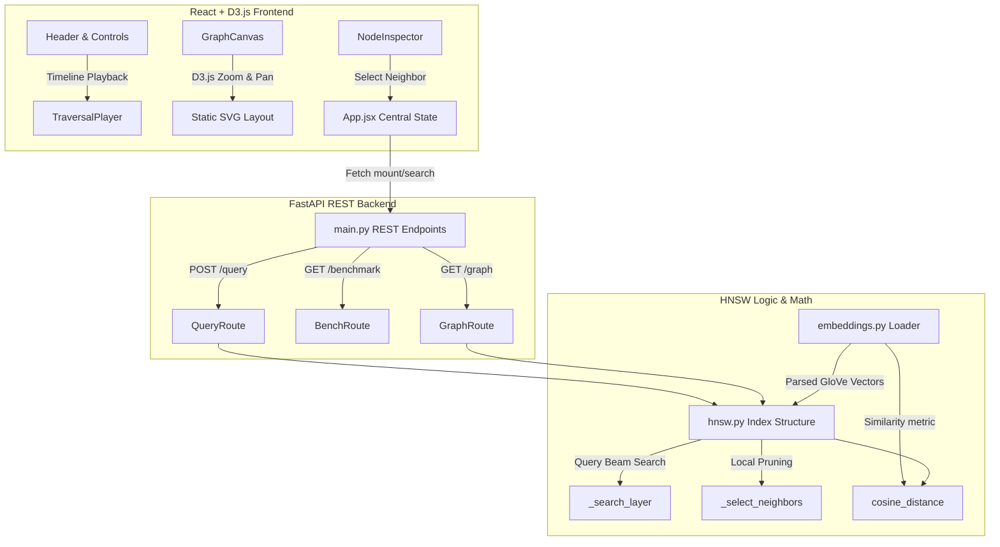
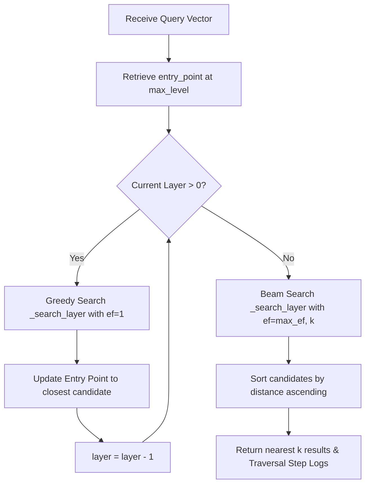

# VectorVault

**Visualize how vector search actually works — watch HNSW graph traversal happen step-by-step on real GloVe word embeddings.**

VectorVault is a visualization-first educational dashboard designed to demystify approximate nearest neighbor (ANN) search. Rather than treating vector search as a black-box library call, VectorVault implements the Hierarchical Navigable Small World (HNSW) algorithm from scratch in Python, hooks it up to a FastAPI server, and maps graph traversals dynamically using D3.js force layouts in the browser.

---

## 🎬 Interactive Traversal Demo

Below is an interactive screen recording of the VectorVault player executing search traversals on real embeddings:


---

## 🚀 System Architecture

VectorVault decouples vector calculations, graph structures, REST services, and SVG render pipelines:



---

## 🛠 Tech Stack

*   **Core Algorithm**: Python 3.13, NumPy (matrix representations, distance computations)
*   **Web Framework**: FastAPI (lifespan bootstrapping caches, async request pipelines)
*   **Frontend Library**: React 18, Vite (fast HMR bundling), D3.js v7 (force layouts, zoom/pan transforms, coordinate maps)
*   **Styling**: Vanilla CSS Variables (premium glassmorphism paneling, dark theme layout grids)
*   **Testing**: Pytest ( embeddings distance tests, structural invariants assertions, test clients endpoint checks)

---

## 📈 Search Traversal Logic Flow

HNSW queries descend greedily through upper sparse layers using greedy routing ($ef=1$), then perform multi-candidate beam search on Layer 0 to retrieve top-$k$ matches:



---

## 📂 Project Structure

```
VectorVault/
├── backend/
│   ├── download_glove.py   # Automated GloVe embedding dataset downloader
│   ├── embeddings.py       # GloVe parser, vector mappings, and similarity bounds
│   ├── hnsw.py             # HNSW class, insert(), query(), and pruning logic
│   ├── main.py             # FastAPI bootstrap loader and REST controllers
│   └── benchmark.py        # Seeded index recall comparator CLI utility
├── docs/
│   ├── DEVELOPMENT_RULES.md # Code standards, styling variables guidelines
│   ├── PROJECT_PLAN.md      # Initial modules scopes definitions
│   └── DECISIONS.md         # Documented technical decisions (benchmark timing values)
├── frontend/
│   ├── package.json
│   ├── index.html
│   ├── src/
│   │   ├── main.jsx
│   │   ├── App.jsx
│   │   ├── index.css       # Layout grid and glassmorphism styling
│   │   ├── components/
│   │   │   ├── Header.jsx           # Search input controls and metrics strip
│   │   │   ├── GraphCanvas.jsx      # React-to-D3 state bridge zoom visualizer
│   │   │   ├── TraversalPlayer.jsx  # Timeline controls slider
│   │   │   ├── ComparisonPanel.jsx  # Side-by-side nearest neighbors matches
│   │   │   └── NodeInspector.jsx    # Clicked node metadata explorer
│   │   └── utils/
│   │       ├── api.js       # Fetch wrappers communicating with backend
│   │       └── nodeColor.js # State color mapper
├── tests/
│   ├── test_embeddings.py   # Similarity calculations unit tests
│   ├── test_hnsw.py         # Level distribution and invariants test
│   └── test_api.py          # FastAPI mock lifespan tests
```

---

## ⚙️ Setup & Installation

### 1. Clone & Environment Setup
Clone the repository and set up a Python virtual environment:
```bash
git clone https://github.com/chavaliadi/vectorvault.git
cd VectorVault
python3 -m venv venv
source venv/bin/activate
pip install -r backend/requirements.txt   # install fastapi, numpy, uvicorn
```

### 2. Download GloVe Embeddings
VectorVault uses real Stanford GloVe word embeddings (50-dimensional). Run the download utility to prepare the dataset:
```bash
python3 backend/download_glove.py
```
*Note: This script downloads the dataset from a fast Hugging Face LFS mirror and falls back to Stanford's official server if needed.*

### 3. Run Backend API Server
Start the FastAPI server:
```bash
uvicorn backend.main:app --reload
```
*Startup lifespan operations automatically load the GloVe vectors, populate an $O(1)$ vocabulary dictionary, build the HNSW layered index, and initialize the endpoints.*

### 4. Run Frontend Visualizer
Open a new terminal window, navigate to the frontend directory, install dependencies, and run the Vite server:
```bash
cd frontend
npm install
npm run dev
```
Open [http://localhost:5173](http://localhost:5173) in your browser to launch the visualization dashboard.

---

## 🔬 Core Traversal Legends & Color Invariants

When executing a search query (e.g. typing "computer" in the search form), the Traversal Player tracks the query trajectory hop-by-hop. Nodes in the Graph Canvas adjust their colors dynamically:

*   🟡 **Current Node**: The active candidate node from which neighbors are being searched.
*   🟢 **Accepted Node**: An evaluated neighbor node that is closer to the query than the current best distance and was pushed to the candidate pool.
*   🔴 **Rejected Node**: An evaluated neighbor node that is further than the current best distance threshold.
*   🔵 **Top-k Result**: Final approximate nearest neighbors matching the word vector.
*   **Static Layer Colors**: Slate (Layer 0), Teal (Layer 1), Cyan (Layer 2), Blue (Layer 3), Violet (Layer 4+).
*   **Traversal path**: An active dashed line is rendered between the `current` and `evaluating` nodes, highlighted in green (accepted) or red (rejected).

---

## 📊 Standalone CLI Benchmark Utility

Compare HNSW approximate recall latency numbers directly against an exact brute-force search over 50 seeded queries:
```bash
python3 -m backend.benchmark
```

Example Output:
```
+-------------------------------------------------+
|                HNSW Benchmark                   |
+----------------------+--------------------------+
| Metric               | Value                    |
+----------------------+--------------------------+
| Queries Run          | 50                       |
| Avg HNSW Time        | 1.8662 ms                |
| Avg Brute Force Time | 26.0342 ms               |
| Avg Recall@10        | 0.9540                   |
+----------------------+--------------------------+
```

---

## 🧪 Testing

VectorVault maintains a clean unit testing suite checking algorithm correctness and endpoint contract validation:
```bash
# Run pytest check suites from the project root
python3 -m pytest
```

---

## 📝 Documented Architectural Decisions

Detailed engineering tradeoffs, performance timing comparisons (such as list vs dictionary access speeds inside hot routing loops), pruning connectivity structures, and D3 canvas layouts are fully documented in the [Design Decisions Log](file:///Users/srinivasch/Documents/Projects/VectorVault/docs/DECISIONS.md).
